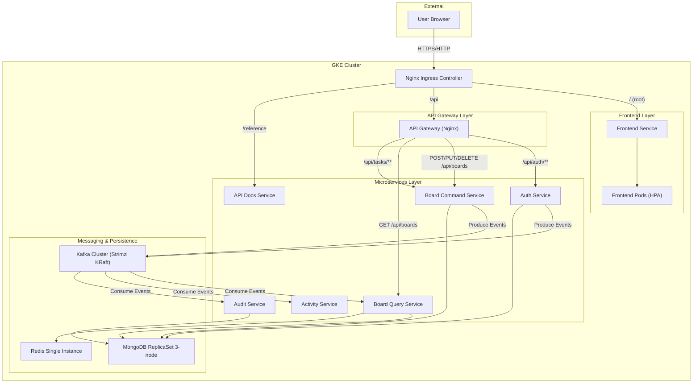
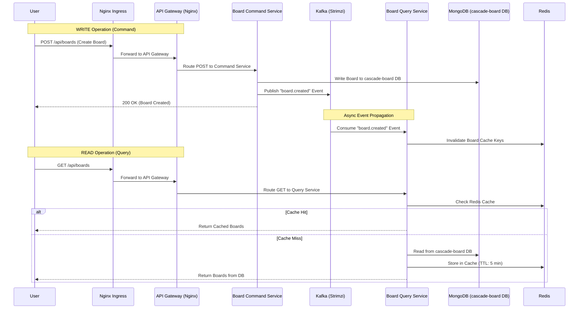
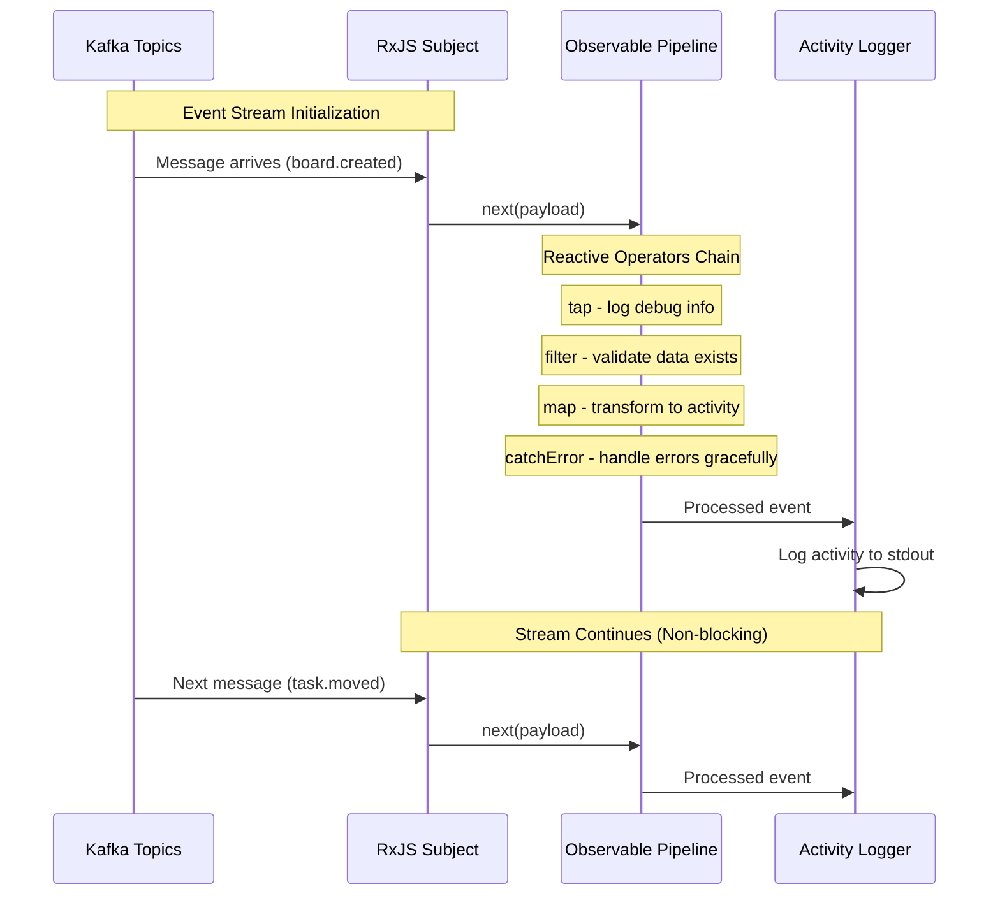

# Cascade Architecture Presentation

## Slide 1: System Architecture on GKE

This diagram illustrates the high-level architecture of Cascade running on Google Kubernetes Engine.

## Slide 2: Microservices Patterns (CQRS & API Gateway)

This diagram details the Command Query Responsibility Segregation (CQRS) pattern and how the API Gateway routes traffic.

**Key Implementation Details:**

- Both Command and Query services connect to the **same MongoDB database** (`cascade-board`)
- Command service writes data directly to MongoDB, Query service reads it
- Events ensure cache invalidation and eventual consistency
- All services in the same MongoDB ReplicaSet but using different databases for separation of concerns

## Slide 3: Reactive Programming Pattern (RxJS)

This diagram shows how the Activity service uses reactive programming with RxJS to process Kafka events as observable streams.

**Key Implementation Details:**

- Activity service uses `ReactiveKafkaConsumer` wrapper for Kafka integration
- Events are processed as RxJS Observable streams with operators
- Demonstrates reactive paradigm with `map`, `filter`, `tap`, and `catchError` operators
- Provides backpressure handling and graceful error recovery

