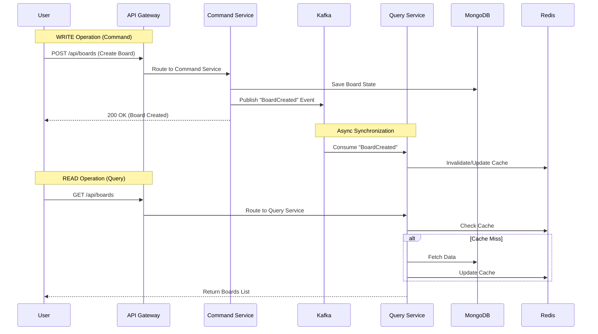

# Cascade Architecture Slides

## Slide 1: System Architecture on GKE

This diagram illustrates the high-level architecture of Cascade running on Google Kubernetes Engine.

```mermaid
graph TB
    subgraph "External"
        User[User Browser]
    end

    subgraph "GKE Cluster"
        Ingress[Nginx Ingress Controller]

        subgraph "API Gateway Layer"
            Gateway[API Gateway (Nginx)]
        end

        subgraph "Frontend Layer"
            FE[Frontend Service]
            FE_Pods[Frontend Pods (HPA)]
        end

        subgraph "Microservices Layer"
            Auth[Auth Service]
            Cmd[Board Command Service]
            Query[Board Query Service]
        end

        subgraph "Messaging & Persistence"
            Kafka[Kafka Cluster (Strimzi)]
            Mongo[MongoDB ReplicaSet]
            Redis[Redis Cluster]
        end
    end

    User -->|HTTPS| Ingress
    Ingress -->|/| FE
    Ingress -->|/api| Gateway

    FE --> FE_Pods

    Gateway -->|/auth| Auth
    Gateway -->|POST/PUT/DELETE| Cmd
    Gateway -->|GET| Query

    Cmd -->|Events| Kafka
    Kafka -->|Events| Query

    Auth --> Mongo
    Cmd --> Mongo
    Query --> Mongo
    Query --> Redis
```

## Slide 2: Microservices Patterns (CQRS & API Gateway)

This diagram details the Command Query Responsibility Segregation (CQRS) pattern and how the API Gateway routes traffic.


